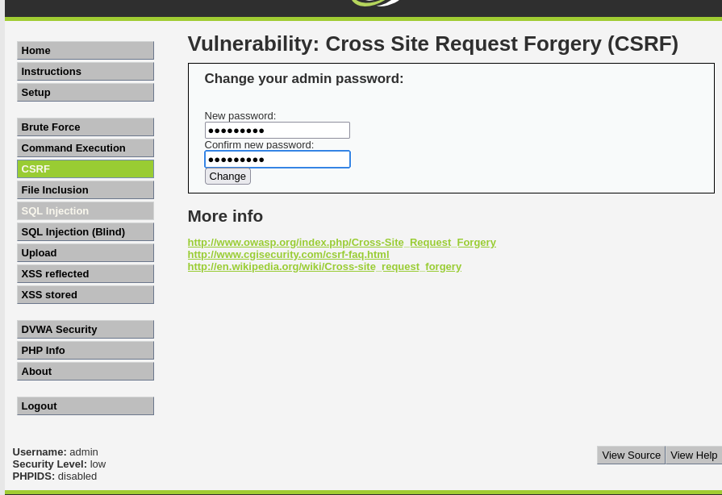
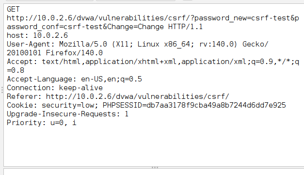
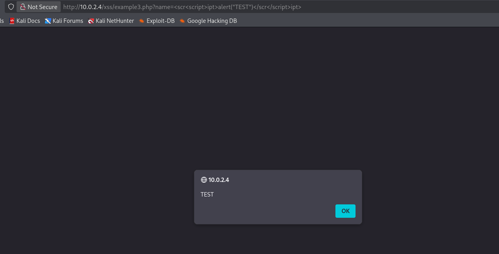
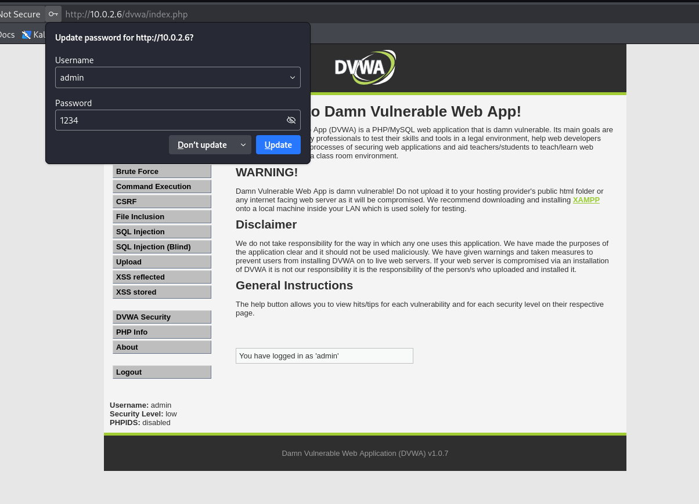

# 🔓 CSRF + XSS Exploitation Lab (DVWA)

Laboratorio de explotación web combinando dos vulnerabilidades clásicas de OWASP: **Cross-Site Request Forgery (CSRF)** y **Cross-Site Scripting (XSS)**, demostrando cómo un atacante puede encadenarlas para ejecutar acciones en nombre de una víctima sin su consentimiento.

## 🎯 Objetivo

Identificar y explotar vulnerabilidades CSRF y XSS en aplicaciones web intencionalmente vulnerables, analizar el tráfico HTTP con un proxy de interceptación, y demostrar un ataque combinado capaz de modificar la contraseña de un usuario autenticado sin que este lo perciba.

## 🧪 Entorno de laboratorio

| Componente | Función |
|---|---|
| **Kali Linux** | Máquina atacante |
| **DVWA** (Damn Vulnerable Web App) | Aplicación objetivo del CSRF |
| **Web for Pentester** | Aplicación objetivo del XSS |
| **OWASP ZAP** | Proxy de interceptación y análisis de tráfico |

Las tres máquinas se desplegaron en VirtualBox sobre una red NAT aislada (`10.0.2.0/24`), verificando conectividad entre ellas antes de empezar.

## 🔍 Metodología

### 1. Identificación de la vulnerabilidad CSRF
Con el nivel de seguridad de DVWA bajado a *Low*, se interceptó mediante **OWASP ZAP** (proxy en `127.0.0.1:8080`) la petición generada al cambiar la contraseña de un usuario:

```
GET /dvwa/vulnerabilities/csrf/?password_new=csrf-test&password_conf=csrf-test&Change=Change HTTP/1.1
Host: 10.0.2.6
Cookie: security=low; PHPSESSID=db7aa3178f9cba49a8b7244d6dd7e925
```

El análisis reveló que la aplicación **no valida el origen de la petición** ni utiliza un token anti-CSRF: la única comprobación es la sesión activa del usuario. Esto convierte el endpoint en un objetivo trivial para un ataque CSRF.



La petición interceptada en ZAP confirma que los parámetros `password_new` y `password_conf`, junto con la cookie de sesión, viajan sin ningún token de protección:



### 2. Identificación de la vulnerabilidad XSS
En **Web for Pentester**, se probó el parámetro `name` de un endpoint reflejado:

```
http://10.0.2.4/xss/example3.php?name=<script>alert('test')</script>
```

La aplicación filtraba la etiqueta `<script>` de forma literal, pero **no sanitizaba variantes del payload**. Mediante una técnica de *bypass* (duplicando y anidando etiquetas para que, tras el filtrado, quedara un `<script>` válido) se consiguió ejecutar JavaScript arbitrario, confirmado con un `alert()` emergente en el navegador:



### 3. Ataque combinado (XSS → CSRF)
Con ambas vulnerabilidades confirmadas, se construyó una página maliciosa que combina:
- Un **iframe oculto** (`display:none`) apuntando a la URL vulnerable de CSRF en DVWA.
- Alojado dentro del recurso vulnerable a XSS en Web for Pentester.

Al visitar el enlace, la víctima solo veía una página inofensiva ("Hello test"), mientras que en segundo plano el iframe enviaba la petición de cambio de contraseña aprovechando su sesión activa en DVWA.

**Resultado:** la contraseña del usuario `admin` se modificó sin interacción ni percepción por su parte. Se confirmó el éxito del ataque iniciando sesión con la nueva contraseña:



## 📊 Hallazgos

| Vulnerabilidad | Causa raíz | Impacto |
|---|---|---|
| CSRF | Ausencia de token anti-CSRF; solo se valida la sesión | Un atacante puede ejecutar acciones (cambio de contraseña, datos, etc.) en nombre de la víctima |
| XSS reflejado | Sanitización de entrada incompleta (filtrado solo de patrones literales) | Permite inyectar y ejecutar JavaScript arbitrario en el navegador de la víctima |
| Combinado | El XSS sirve de vector de entrega silenciosa para el CSRF | Escala el impacto: de "requiere que la víctima haga clic" a "ejecución transparente" |

## 🛡️ Remediación

- **CSRF:** implementar tokens anti-CSRF únicos por sesión/petición, validados en el servidor antes de procesar la acción.
- **XSS:** sanitizar y codificar (output encoding) toda entrada de usuario antes de reflejarla en el HTML; aplicar una Content Security Policy (CSP) restrictiva.
- **Defensa en profundidad:** no depender únicamente de la cookie de sesión como mecanismo de autorización para acciones sensibles (añadir confirmación explícita, cabecera `SameSite` en cookies, etc.).

## 🛠️ Herramientas utilizadas

`Kali Linux` · `DVWA` · `Web for Pentester` · `OWASP ZAP` · `Firefox DevTools`

---

> ⚠️ Laboratorio realizado en un entorno aislado y controlado con aplicaciones deliberadamente vulnerables (DVWA, Web for Pentester), diseñadas para fines formativos. Las técnicas aquí descritas no deben aplicarse sobre sistemas sin autorización explícita.
