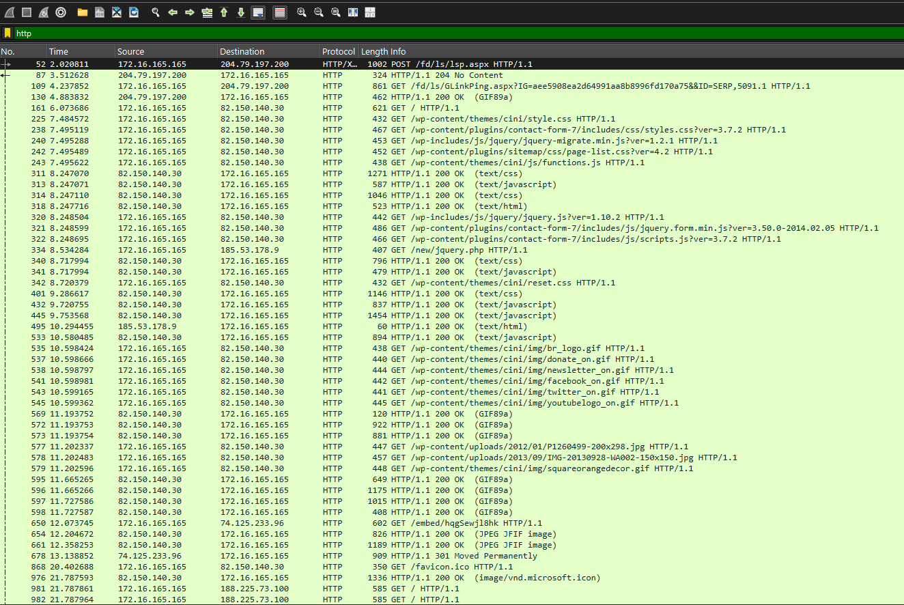
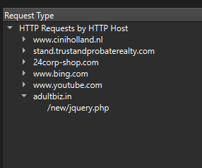
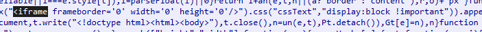
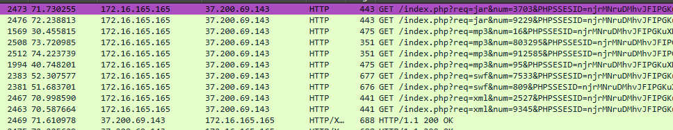

# 🕸️ Análisis de tráfico malicioso (PCAP) — Cadena de infección web

Análisis forense de una captura de tráfico de red (`.pcap`) con **Wireshark**, reconstruyendo paso a paso una cadena real de infección: desde la navegación aparentemente normal de un usuario hasta la entrega de un exploit kit.

## 🎯 Objetivo

Analizar una captura de tráfico de red para identificar el host comprometido, reconstruir la secuencia de redirecciones que lo llevó a la infraestructura maliciosa, y determinar el objetivo final del ataque.

## 🧪 Entorno

| Componente | Función |
|---|---|
| **Wireshark** | Análisis de la captura `.pcap` |
| Estadísticas → Jerarquía de protocolos / HTTP → Peticiones | Identificación de dominios y protocolos involucrados |

## 🔍 Metodología

### 1. Identificación del host afectado
Filtrando por tráfico HTTP se observa que una única IP interna, **`172.16.165.165`**, inicia todas las conexiones sospechosas, realiza múltiples peticiones HTTP y accede a los dominios maliciosos detectados en el resto del análisis:



### 2. Reconstrucción de la cadena de dominios
Mediante **Estadísticas → HTTP → Peticiones**, Wireshark permite ver todos los hosts HTTP contactados durante la captura, en orden:



```
www.ciniholland.nl
stand.trustandprobaterealty.com
24corp-shop.com
www.bing.com
www.youtube.com
adultbiz.in
   └── /new/jquery.php
```

El dominio `24corp-shop.com` nunca fue visitado directamente por el usuario: no hay ninguna petición GET previa que lo explique, lo que indica una carga automática.

### 3. El vector: un iframe oculto
Reconstruyendo el flujo TCP de la página inicial, aparece un `<iframe>` con `width='0' height='0'` y `display:none`, inyectado para cargar contenido externo sin que el usuario lo perciba:



Este iframe es el que dispara, sin interacción del usuario, la navegación hacia el resto de la cadena.

### 4. Comportamiento de exploit kit
Tras la redirección a `stand.trustandprobaterealty.com`, el tráfico muestra decenas de peticiones con el patrón `/index.php?req=<tipo>&num=<id>&PHPSESSID=...`, variando el parámetro `req` entre `jar`, `mp3`, `swf` y `xml`:



Este patrón —sondear distintos formatos (Java, Flash, XML) con una sesión persistente— es característico de un **exploit kit**: el servidor va probando qué plugins vulnerables tiene el navegador de la víctima antes de decidir qué payload entregar.

### 5. Confirmación del servidor malicioso
El dominio final, `adultbiz.in`, resuelve a `185.53.178.9` y sirve `/new/jquery.php` sobre el puerto 80/TCP con respuesta `200 OK` — un nombre de archivo que imita una librería legítima (jQuery) para pasar desapercibido en los logs.

## 📊 Hallazgos

| Elemento | Valor |
|---|---|
| Host comprometido | `172.16.165.165` |
| Vector de entrada | Iframe oculto inyectado en `www.ciniholland.nl` |
| Servidor del exploit kit | `stand.trustandprobaterealty.com` (`37.200.69.143`) |
| Servidor de payload final | `adultbiz.in` (`185.53.178.9:80`) |
| Recurso de entrega | `/new/jquery.php` (nombre camuflado) |

## 🛡️ Conclusión

La captura evidencia una cadena de infección web típica (*drive-by download*): un sitio aparentemente legítimo comprometido inyecta un iframe invisible que redirige al navegador, sin ninguna acción del usuario, hacia infraestructura de un exploit kit que sondea los plugins instalados antes de intentar entregar malware. Todo el tráfico va **sin cifrar sobre HTTP**, lo que facilita este tipo de análisis pero también confirma que ni el sitio de origen ni la cadena de redirecciones usaban HTTPS — una señal de alerta por sí sola.

## 🛠️ Herramientas utilizadas

`Wireshark` (Jerarquía de protocolos, estadísticas HTTP, Follow TCP Stream)

---

> ⚠️ Captura de tráfico real de una campaña de malware conocida, usada en un entorno académico controlado con fines exclusivamente formativos.
