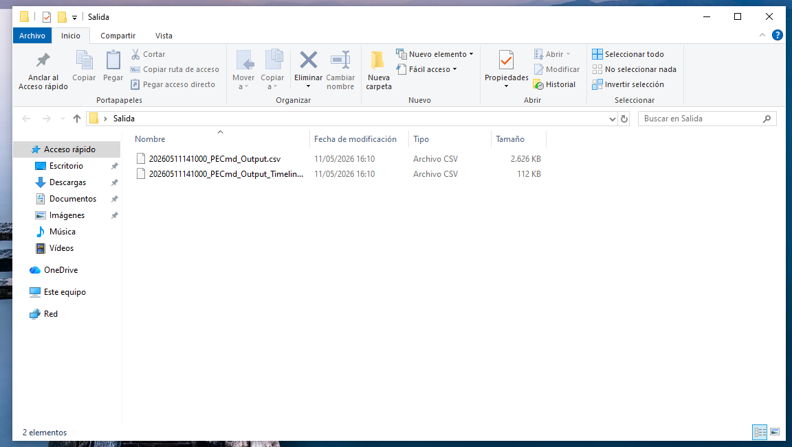
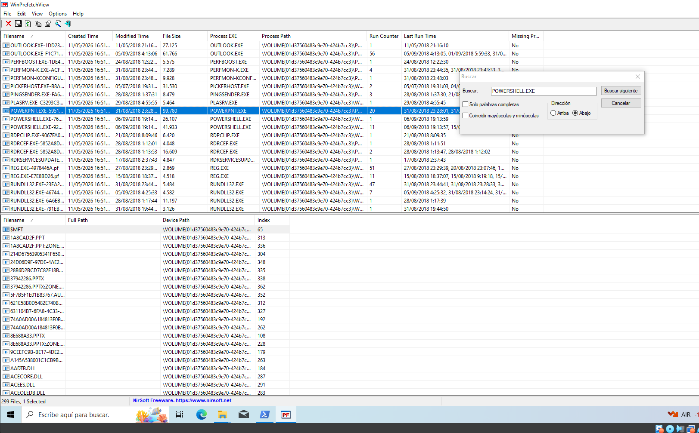
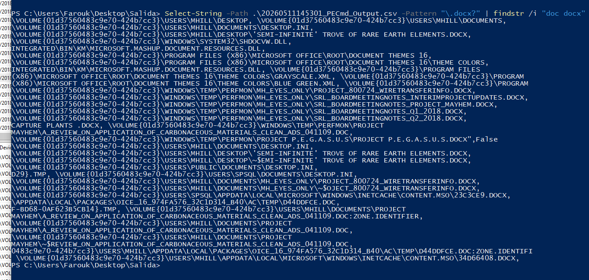
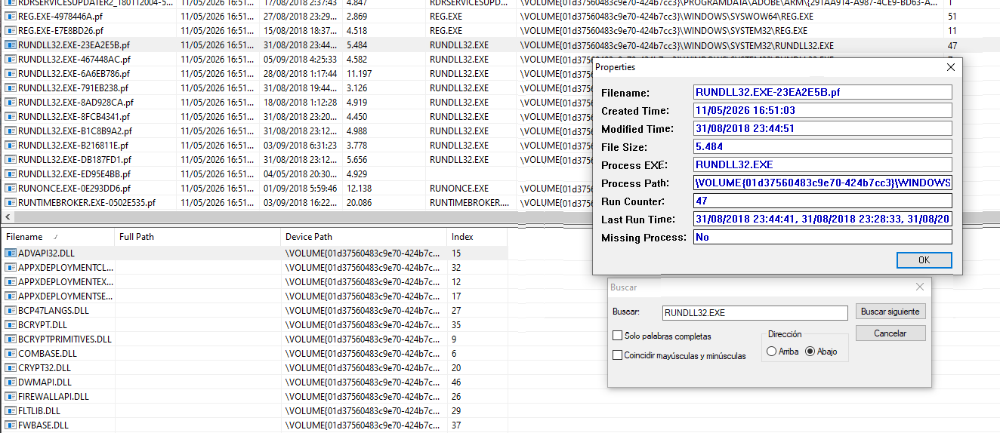

# 🔬 Análisis forense de artefactos Prefetch (Windows)

Análisis forense digital de los artefactos **Prefetch** de Windows (`.pf`) para reconstruir la actividad de ejecución de un sistema: qué programas se ejecutaron, cuándo, y qué evidencias indirectas dejan sobre documentos abiertos y posibles mecanismos de persistencia de un atacante.

## 🎯 Objetivo

Procesar la carpeta `Prefetch` de un sistema Windows 10 para identificar: actividad de consola (PowerShell/CMD), posibles conexiones remotas, documentos ofimáticos abiertos, e indicios de un payload usado para persistencia.

## 🧪 Entorno y herramientas

| Herramienta | Función |
|---|---|
| **Windows 10** (VM) | Sistema analizado |
| **PECmd** (Eric Zimmerman's EZTools) | Parseo masivo de archivos `.pf` → CSV |
| **WinPrefetchView** | Inspección visual rápida de artefactos Prefetch |
| **PowerShell** (`Select-String`) | Búsquedas y filtrado sobre el CSV generado |
| **FTK Imager** | Acceso a la imagen forense (`image.ad1`) |

## 🔍 Metodología

### 1. Procesamiento masivo con PECmd
Se ejecutó PECmd sobre la carpeta `Prefetch` completa, generando un CSV con metadatos de ejecución (nombre, rutas de DLL cargadas, contador de ejecuciones, timestamps) de cada artefacto `.pf`:

```powershell
.\PECmd.exe -d "C:\Users\Farouk\Desktop\Prefetch" --csv "C:\Users\Farouk\Desktop\Salida"
```



Dado que el CSV resultante era difícil de inspeccionar directamente en Excel, se usó **WinPrefetchView** para el análisis visual.

### 2. Actividad de consola
Se localizaron múltiples artefactos de `POWERSHELL.EXE` y `CMD.EXE`, con sus contadores de ejecución y marcas de tiempo:



- `POWERSHELL.EXE-76FB1AE.pf`: primera y última ejecución el mismo día (06/09/2018).
- `POWERSHELL.EXE-920BBA2A.pf`: primera ejecución 15/08/2018, última el 06/09/2018.
- `CMD.EXE-AC113AA8.pf`: ejecutado el 06/09/2018 entre las 19:14:51 y las 19:15:26.

La presencia de múltiples artefactos de PowerShell en una ventana de tiempo corta es compatible con actividad de administración o scripting automatizado, pero por sí sola no es concluyente de intención maliciosa.

### 3. Posibles conexiones remotas
Se buscaron artefactos de herramientas de acceso remoto habituales (`MSTC.EXE`, `PSEXEC.EXE`, `TEAMVIEWER.EXE`, `ANYDESK.EXE`) sin encontrar ninguna evidencia directa. No puede confirmarse ni descartarse el uso de PowerShell como mecanismo de administración o ejecución remota.

### 4. Documentos ofimáticos abiertos
Filtrando el CSV de PECmd por referencias a `.doc`/`.docx` mediante PowerShell:

```powershell
Select-String -Path .\PECmd_Output.csv -Pattern "\.docx?" | findstr /i "doc docx"
```



Se identificaron varios documentos de interés abiertos en el sistema, incluyendo nombres con connotación potencialmente sensible (notas de reuniones de consejo, proyectos con nombre en clave). No se reproduce aquí el listado completo de nombres de archivo por tratarse de material de un escenario de laboratorio con datos simulados.

### 5. Indicios de persistencia
El cruce de PECmd + búsquedas en PowerShell reveló referencias a archivos de transcripción de PowerShell (`POWERSHELL_TRANSCRIPT`), y actividad reiterada de `RUNDLL32.EXE` —un binario comúnmente usado para cargar DLLs y ejecutar código de forma indirecta—, con hasta 47 ejecuciones registradas:



Siguiendo las referencias numéricas encontradas en los logs de transcripción de PowerShell, se derivó una credencial que permitió acceder a contenido protegido dentro de la imagen forense (`image.ad1`), confirmando que la secuencia hallada era válida. *(El valor concreto de la credencial no se incluye en este repositorio, al tratarse de datos específicos del escenario de laboratorio.)*

## 📊 Hallazgos

| Artefacto | Observación |
|---|---|
| `POWERSHELL.EXE` | Múltiples ejecuciones en la franja del 15/08–06/09/2018 |
| `CMD.EXE` | Una sesión breve el 06/09/2018 |
| Herramientas de acceso remoto | Sin evidencia directa en Prefetch |
| `WINWORD.EXE` | 33 ejecuciones; varios documentos con nombres sensibles |
| `RUNDLL32.EXE` | 47 ejecuciones — compatible con mecanismos de persistencia vía DLL |
| Transcripciones PowerShell | Referencias que permitieron derivar una credencial válida |

## 🛡️ Conclusión

La correlación entre la actividad elevada de `POWERSHELL.EXE` y `RUNDLL32.EXE` es **compatible** con un mecanismo de persistencia basado en PowerShell y ejecución vía DLL, aunque los artefactos Prefetch por sí solos no permiten determinar el payload exacto utilizado — para eso haría falta cruzar esta evidencia con otros artefactos (Registro, Amcache, logs de eventos, memoria). Esto ilustra tanto el valor como el límite de Prefetch en una investigación: es un buen punto de partida para generar hipótesis, no una prueba concluyente por sí mismo.

## 🛠️ Herramientas utilizadas

`PECmd` · `WinPrefetchView` · `PowerShell` · `FTK Imager`

---

> ⚠️ Análisis realizado sobre una imagen forense de laboratorio con datos simulados, en un entorno aislado y con fines exclusivamente formativos.
