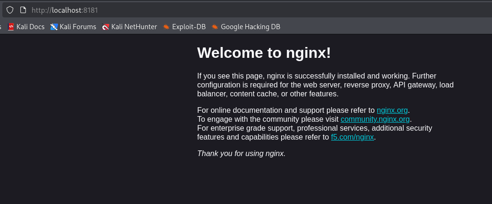
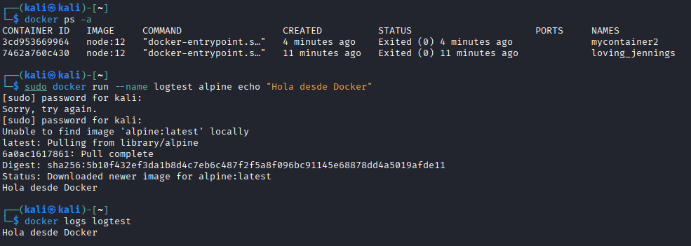
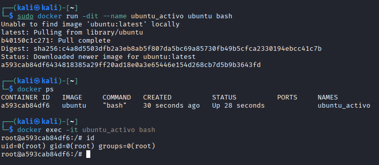
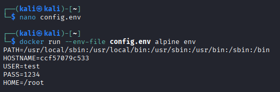

# 🐳 Docker fundamentals lab

Laboratorio práctico de Docker en Kali Linux: instalación, gestión del ciclo de vida de contenedores, mapeo de puertos, logs, acceso interactivo, redes/volúmenes y configuración mediante variables de entorno.

## 🎯 Objetivo

Familiarizarse con Docker como herramienta de virtualización ligera: instalar el motor, ejecutar y gestionar contenedores, exponer servicios al host, inspeccionar su estado y configurarlos sin hardcodear credenciales en el historial de comandos.

## 🔍 Metodología

### 1. Instalación y permisos
```bash
sudo apt update && sudo apt install docker.io -y
sudo systemctl enable --now docker
```
Tras el primer intento sin privilegios (`permission denied` al socket de Docker), se añadió el usuario al grupo `docker` para evitar usar `sudo` en cada comando:
```bash
sudo usermod -aG docker $USER
```

### 2. Mapeo de puertos (port forwarding)
Se desplegó un contenedor Nginx exponiendo el puerto 80 del contenedor en el 8181 del host:
```bash
docker run -dit --name webtest -p 8181:80 nginx
```


### 3. Ciclo de vida de contenedores
Se practicó la gestión completa: listar, crear, parar, iniciar y eliminar contenedores (`docker ps`, `docker ps -a`, `stop`, `start`, `rm`):


Un hallazgo relevante: un contenedor cuyo proceso principal termina (como `node:12` sin comando persistente) se detiene inmediatamente después de arrancar — Docker vive mientras vive su proceso PID 1, no es una VM persistente por defecto.

### 4. Logs en tiempo real
Para comprobar `docker logs`, se creó un contenedor con un bucle que genera salida constante, confirmando que `docker logs -f` sigue el stream en vivo (análogo a `tail -f`).

### 5. Acceso interactivo al contenedor
```bash
docker run -dit --name ubuntu_activo ubuntu bash
docker exec -it ubuntu_activo bash
```


Confirmado con `id`: el usuario dentro del contenedor es `root` (uid=0) salvo que la imagen especifique lo contrario — una consideración de seguridad a tener en cuenta en entornos de producción (usar `USER` en el Dockerfile o `--user` en el run).

### 6. Redes y volúmenes
`docker network ls` y `docker volume ls` mostraron las redes por defecto (`bridge`, `host`, `none`) y la ausencia de volúmenes persistentes creados hasta el momento, confirmando que sin un volumen explícito los datos del contenedor son efímeros.

### 7. Variables de entorno sin exponer credenciales
Se comparó pasar variables directamente (`-e VAR=valor`, visible en el historial de shell) frente a usar un fichero de entorno:
```bash
docker run --env-file config.env alpine env
```


Esta segunda forma evita que credenciales queden registradas en `.bash_history` o en los logs del propio Docker daemon al listar procesos.

## 📊 Hallazgos / buenas prácticas confirmadas

| Observación | Implicación |
|---|---|
| Un contenedor muere si su proceso principal termina | Hay que diseñar la imagen/comando para mantenerlo vivo si se necesita persistente |
| El usuario por defecto dentro del contenedor es root | Riesgo de seguridad si se compromete la app dentro; usar `USER` no-root en producción |
| `-e` dentro del comando queda en el historial de shell | Preferir `--env-file` para no exponer secretos |
| Volúmenes no son automáticos | Sin un volumen explícito, los datos del contenedor se pierden al eliminarlo |

## 🛠️ Herramientas utilizadas

`Docker Engine` · `Kali Linux` · `Nginx` (imagen oficial) · `Alpine` / `Ubuntu` (imágenes base)

---

> ⚠️ Laboratorio realizado en un entorno de pruebas aislado, con fines exclusivamente formativos.
